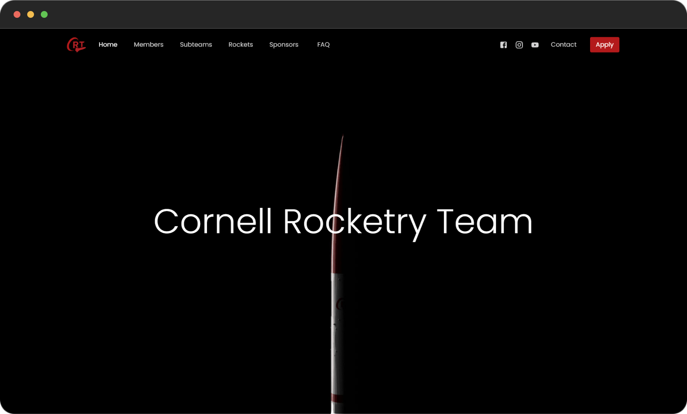
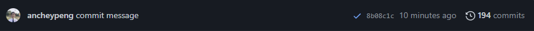
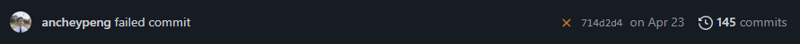

<a name="readme-top"></a>


<!-- PROJECT LOGO -->
<br />
<div align="center">
  <a href="https://github.com/cornellrocketryteam/rocketry-web">
    
  </a>

<h1 align="center">Cornell Rocketry Team Website</h1>
</div>


<!-- TABLE OF CONTENTS -->
<details>
  <summary>Table of Contents</summary>
  <ol>
    <li>
      <a href="#about-the-project">About The Project</a>
      <ul>
        <li><a href="#built-with">Built With</a></li>
      </ul>
    </li>
    <li>
      <a href="#getting-started">Getting Started</a>
      <ul>
        <li><a href="#prerequisites">Prerequisites</a></li>
        <li><a href="#installation">Installation</a></li>
        <li><a href="#usage">Usage</a></li>
      </ul>
    </li>
    <li>
      <a href="#usage">Updating the website</a>
      <ul>
        <li><a href="#general">General</a></li>
        <li><a href="#homepage">Homepage</a></li>
        <li><a href="#members-page">Members Page</a></li>
        <li><a href="#Rockets-page">Rockets Page</a></li>
        <li><a href="#Sponsors-page">Sponsors Page</a></li>
        <li><a href="#FAQ-page">FAQ Page</a></li>
        <li><a href="#apply-page">apply Page</a></li>
      </ul>
    </li>
  </ol>
</details>


<!-- ABOUT THE PROJECT -->
## About The Project

[](https://example.com)


### Built With

* [![Next][Next.js]][Next-url]
* [![React][React.js]][React-url]
* [![Material UI][Material-ui]][material-ui-url]

<p align="right">(<a href="#readme-top">back to top</a>)</p>


<!-- GETTING STARTED -->
## Getting Started


### Prerequisites

Start by installing the required software to be able to run the website. 

* Install a text editor like VS Code: https://code.visualstudio.com/
* Install Node.js: https://nodejs.org/en

### Installation

1. Clone the repo
    ```sh
    git clone https://github.com/cornellrocketryteam/rocketry-web
    ```
2. Navigate into the newly cloned repository
    ```sh
    cd rocketry-web
    ```
3. Install NPM packages
    ```sh
    npm install
    ```

### Usage

1. Run the development server
    ```sh
    npm run dev
    ```
2. Open [http://localhost:3000](http://localhost:3000) with your browser to see the result.

<p align="right">(<a href="#readme-top">back to top</a>)</p>


## Updating the Website

### General
- When running the development server, any file changes will automatically update on the local website version.
- Comitting and pushing the code to Github should automatically update the live version of the website.
  - If the live version of the website is not updating, check the Github repo for any potential errors with the commit or the deployment.
   
  

    ☑️ indicates that the build was sucessful and deployed to the live website.

    ❌ indicates that the build failed and did not deploy to the live website.

    Clicking on either of the icons will allow you to view the logs and determine if and why the build failed.


### Homepage

The only content that changes on the homepage year to year is the "At a Glance" statistics. These can be manually updated on the homepage file [index.js](pages/index.js). Using `Ctrl + F` is an easy way to find where to update the numbers.

### Members Page

The members page must be updated whenever there are new members added to the team. 

This can be done using the JSON file [members.json](public/static/members/members.json). Member pictures must be placed in the folder [public/static/images/members-page](public/static/images/members-page). The picture file names must match with the member's name in the JSON file. Make sure that the JSON file is formatted correctly or the page will not load.

The photos should be cropped to a **3:4 aspect ratio**, and they should be compressed or reduced in size so that the file size is smaller and the images will load faster on the website. Cropping to 375 x 500 pixels will match the correct aspect ratio and minimize the file size, but larger images can also be used.


### Rockets Page

The rockets page must be updated each year with new rocket information and the year's competition patch. 

The information about each year's rocket can be updated through the JSON file [rockets.json](public/static/rockets/rockets.json). When adding a new rocket to the JSON file, the corresponding image of the rocket must also be added to the folder [public/static/images/rockets-page/rockets](public/static/images/rockets-page/rockets). 

Competition patches can be updated by adding the new patch to the folder [public/static/images/rockets-page/patches](public/static/images/rockets-page/patches), and the patch will be automatically added on the website.


### Sponsors Page

The sponsors page must be updated whenever there are new sponsors or the sponsorship packet has been updated. 

Sponsor logos can be updated through the JSON file [sponsors.json](public/static/sponsors/sponsors.json). When adding a new sponsor logo to the JSON file, the corresponding logo image must also be added to the folder [public/static/images/sponsors-page/logos](public/static/images/sponsors-page/logos). Logos might have to be edited using Photoshop or some other software to remove the background and to ensure readability. Try to find versions of company logos that will look good on the website, for example some companies have light and dark versions of their logos.

The sponsorship packet can be updated by replacing the file [CRT Sponsorship Packet.pdf](public/static/CRT%20Sponsorship%20Packet.pdf). Make sure that the same file name is used for the new packet.


### FAQ Page

The FAQ page can be updated using the JSON file [faq.json](public/static/faq/faq.json).

### Apply Page

The apply page must be updated whenever the team is recruiting.

The content on the apply page can be updated through the JSON file [apply.json](public/static/apply/apply.json). There are multiple fields in the JSON file that need to be changed each time the team recruits. 

- `dayjsFormatString` should not be changed.
- `applicationOpen` determines whether the application page will show the open or closed version. It should be set to `true` when recruitment is ongoing and set to `false` when recruitment is finished.
- `upperclassDueDate`, `firstYearDueDate`, `upperclassApplicationLink`, and `firstYearApplicationLink` should be updated to the corresponding dates and links for the current year.
- `timelineData` contains all of the events and key dates that will be shown on the apply page's timeline. This includes dates like the application open, information sessions, club fests, and the application due dates. For reference, the file [example.json](public/static/apply/example.json) shows a properly formatted json file with all of the necessary information for the timeline. 
  - Make sure to include all information sessions and application due dates
  - All timeline dates must be formatted in the format `M/D H:mm a` where `M` is the month, `D` is the day, `H` is the hour, `mm` is the minutes, and `a` is either am or pm. More details about this format can be found [here](https://day.js.org/docs/en/parse/string-format). Reference [example.json](public/static/apply/example.json) for properly formatted dates.


<p align="right">(<a href="#readme-top">back to top</a>)</p>


[Next.js]: https://img.shields.io/badge/next.js-000000?style=for-the-badge&logo=nextdotjs&logoColor=white
[Next-url]: https://nextjs.org/
[React.js]: https://img.shields.io/badge/React-20232A?style=for-the-badge&logo=react&logoColor=61DAFB
[React-url]: https://reactjs.org/
[Material-ui]: https://img.shields.io/badge/Material--UI-0081CB?style=for-the-badge&logo=mui&logoColor=white
[Material-ui-url]: https://mui.com/material-ui/